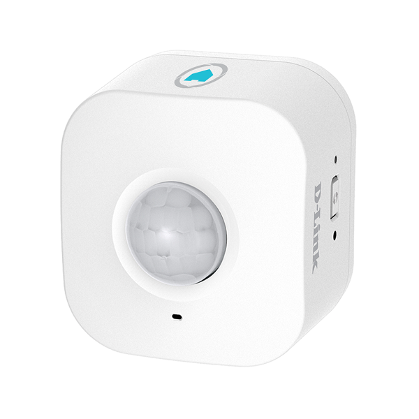

# ioBroker.mydlink

  

MyDlink Adapter für ioBroker. 
------------------------------------------------------------------------------

Dieser Adapter erlaubt es Geräte (Steckdosen und Bewegungsmelder) von 
[D-Link](https://eu.dlink.com/uk/en/for-home/smart-home) in ioBroker zu 
integrieren. 

**Dieser Adapter nutzt die Sentry Bibliothek um automatisch Fehler im Adapter an den Entwickler zu schicken.**
Für mehr Details und wie man die automatische Fehlerberichterstattung 
abschaltet, siehe die [Dokumentation des Sentry-Plugins](https://github.com/ioBroker/plugin-sentry#plugin-sentry)! 
Sentry wird erst ab js-controller Version 3.0 unterstützt.

Bisher wurden die folgenden Geräte erfolgreich mit dem Adapter getestet:
(weitere gerne melden)

| Model | Type  | Image |
| :---: | :---: | :---: |
| DSP-W215 | Steckdose (schalten, Temperatur, Strom) **Muss gepollt werden** |  |
| DSP-W115 | Steckdose (schalten) |  | 
| DCH-S150 | Bewegungsmelder **Muss gepollt werden** |  |

Ältere Geräte, wie die DSP-W215 oder der DCH-S150 müssen vom Adapter gepollt werden,
was bedeutet, dass es immer eine kurze Verzögerung für den Statusreport an ioBroker
gibt. Das ist besonders beim Bewegungsmelder ungünstig. Der DSP-W115 und andere
neuere Geräte liefern ihren Status sofort an den ioBroker.

Das Pollintervall kann pro Gerät einzeln eingestellt werden.

#### Konfiguration:
* Alle Geräte müssen in der Liste konfiguriert werden:

<table>
<tr><td>Name</td><td>Name, beliebig</td></tr>
<tr><td>IP</td><td>IP Adresse oder Hostname des Geräts</td></tr>
<tr><td>PIN</td><td>Die PIN steht auf der Gerät, z.B. auf dem Boden. Für DSP-W115 kann hier auch TELNET eingegeben werden, siehe unten.</td></tr>
<tr><td>Poll interval (in ms)</td><td>Poll interval  Auf 0 setzen um polling abzuschalten.  <b>Empfehlung:</b> Nutze ein kurzes Intervall für Bewegungsmelder und ein längeres für Steckdosen.</td></tr>
<tr><td>enable</td><td>Wenn hier kein Haken ist, wird das Gerät nicht angesprochen. So können Geräte, die eine Zeitlang nicht eingesteckt sind (z.B. für Weihnachtsdeko) einfach deaktiviert werden und der Adapter meldet keine Fehler im log.</td></tr>
</table>

Für alte Geräte stört die Nutzung des Adapters die Nutzung der App nicht. Für neuere Geräte, wie die DSP-W115 ist das etwas anders, siehe unten.

## Einrichten des DSP-W115

Der DSP-W115 und andere *neuere* Geräte nutzen ein völlig anderes Protokoll als die änteren.
Wenn das Gerät aus der App gelöscht wird, kann, wie früher auch, einfach die PIN
genutzt werden.

Ansonsten, wenn die App weiter genutzt werden soll, muss das Gerät in den "factory mode" gesetzt werden.
Das erreicht man wie folgt:
1. Das Gerät in den Wiederherstellungsmodus versetzen in dem die WPS/Reset Taste während dem Starten festgehalten wird, bis es **rot** blinkt (statt orange!). 
2. Jetzt wurde ein telnet Port geöffnet, verbinde nun einen Laptop oder ähnliches mit dem Geräte-Wifi (DSP-W115-XXXX).
3. Verbinde dich mit telnet `telnet 192.168.0.20` und logge dich ein mit `admin:123456`
(in Linux einfach auf der Konsole, in Windows geht es über putty, dort muss `telnet` ausgewählt werden).
4. Aus dem Gerät über telnet ausführen: `nvram_set FactoryMode 1`
5. Dann mit `reboot; exit;` (auf dem Gerät ausführen) neustarten.

Jetzt kann in der Adapterkonfiguration `TELNET` als Pin eingegeben werden und
der Adapter holt sich (über den offenen telnet Port) alle Informationen von dem
Gerät, die er braucht. 
